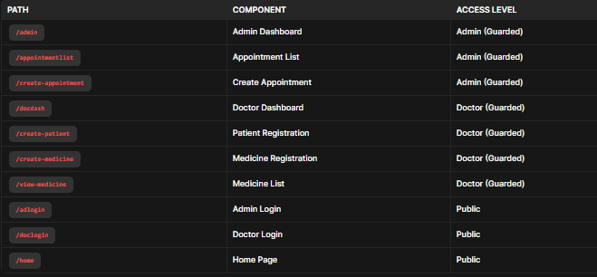

# Frontend for Hospital Management System

This Angular project provides a web-based interface for managing hospital operations, including patient records, appointments, and medical inventory. The application features role-based access control for administrators and doctors.

## Table of Contents

- [Features](#features)
- [Getting Started](#getting-started)
- [Routing Structure](#routing-structure)
- [Development](#development)
- [Testing](#testing)
- [Built With](#built-with)
- [Contributing](#contributing)

## Features

- **Role-based Access**: Separate dashboards for Admins and Doctors
- **Patient Management**: Create, view, and update patient records
- **Appointment Scheduling**: Manage medical appointments
- **Medicine Inventory**: Track and manage medical supplies
- **Authentication**: Secure login for admin and doctor roles

## Getting Started

### Prerequisites

- Node.js 18+
- Angular CLI 19.1.7

```bash
npm install -g @angular/cli@19.1.7
```

## Installation

Clone the repository
To clone the repository to your local machine:

1. Copy the repository URL from GitHub.
2. Open a terminal and run the following command:

```bash
git clone https://github.com/<your-username>/hospital-management-system-frontend.git
```

3. Navigate into the project directory:

```bash
cd hospital-management-system-frontend
```

## Install Frontend Dependencies

To install the required dependencies for the frontend project:

```bash
npm install
```

## Routing Structure


